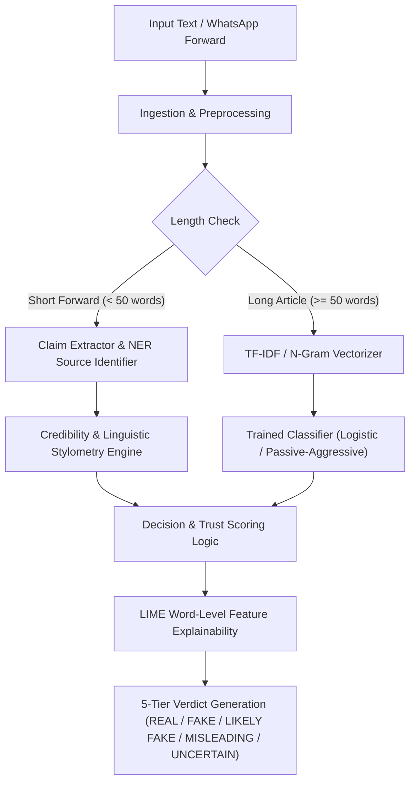
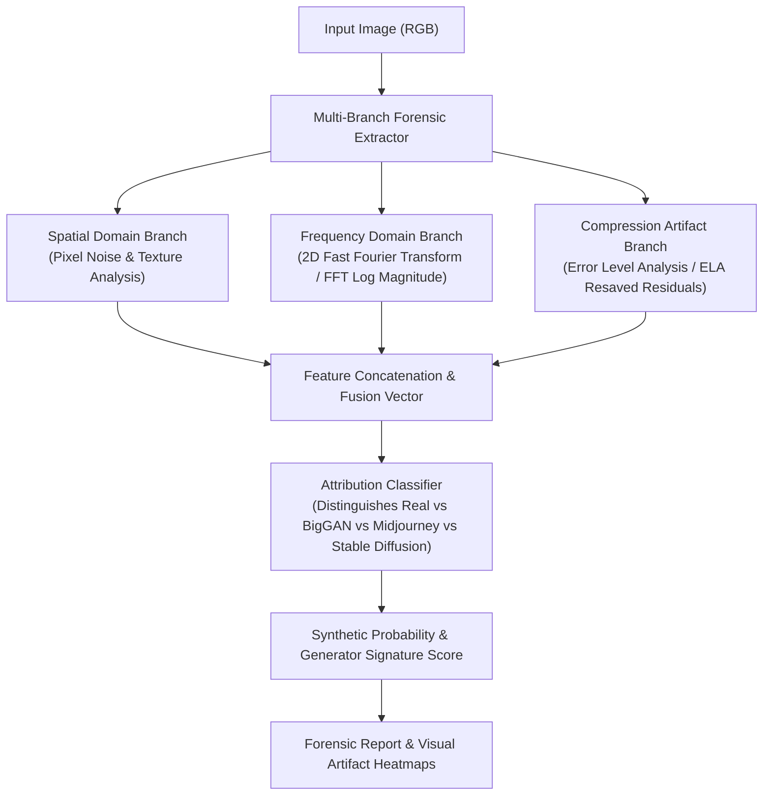
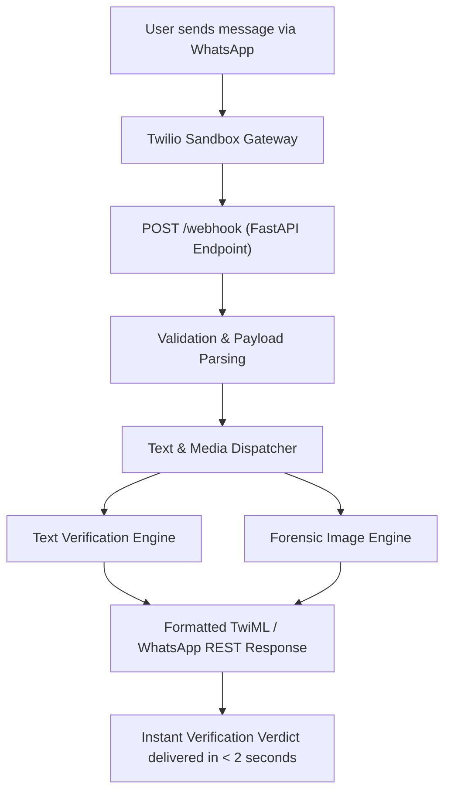

# Multimodal Fake News & Image Forensics Intelligence Backend

A production-grade verification backend that ingests news articles, social forwards, and suspicious media, extracts linguistic, spatial, and frequency-domain features, and generates transparent credibility verdicts without hard-depending on opaque LLM wrappers.

This project focuses on deterministic machine learning pipelines, frequency-domain image forensics (FFT / ELA / Noise analysis), generator attribution across diffusion models and GANs, and robust backend production safeguards.

> **Active Development Note:** The core text verification engine operates in standalone machine learning mode (deterministic feature extraction with zero external LLM dependencies for baseline classification). The deep image forensics and generative AI model attribution pipeline is currently under active engineering and benchmark expansion across CIFAKE and GenImage datasets.

---

## Tech Stack

- **Python 3.9+**
- **PyTorch** (Deep Learning & Image Forensic Baselines)
- **Scikit-learn** (TF-IDF Vectorization, Passive-Aggressive, Logistic Regression, Naive Bayes)
- **OpenCV & NumPy** (FFT Spectrum Analysis, Error Level Analysis, Noise Inconsistency)
- **FastAPI & Uvicorn** (High-throughput REST API & Webhook Server)
- **Twilio WhatsApp API** (End-to-end messaging verification bot)
- **LIME** (Local Interpretable Model-agnostic Explanations)
- **spaCy** (Named Entity Recognition for institutional sources)
- **Groq LLM API** (`llama-3.3-70b-versatile` — optional semantic verification layer)
- **ngrok** (Local tunnel automation with auto-URL resolution)

---

## System Pipelines

### 1. Standalone Text Verification Pipeline



---

### 2. Image Forensics & AI Attribution Pipeline (Active Work)



---

### 3. WhatsApp Webhook & API Ingestion Pipeline



---

## Core Concepts Implemented

### Standalone Machine Learning Engine (Zero-LLM Core)
- Engineered without relying on third-party LLM API calls for core classification.
- Uses TF-IDF n-gram tokenization and ensemble classifiers trained on 44,000+ verified news records.
- Achieves sub-second inference with zero token costs and deterministic outputs.

### Deep Image Forensics & Frequency-Domain Analysis *(Active Work)*
- **2D-FFT Analysis**: Detects checkerboard patterns and periodic frequency spikes characteristic of upsampling layers in GANs and diffusion decoders.
- **Error Level Analysis (ELA)**: Computes compression error variance across JPEG blocks to flag spliced or non-uniformly compressed regions.
- **Noise Inconsistency Extraction**: Isolates high-pass spatial noise fingerprints to detect artificial smoothing or synthetic generative artifacts.

### Generative AI Model Attribution
- Multi-class attribution trained to distinguish between real camera captures and synthetic images generated by **Midjourney**, **BigGAN**, **Stable Diffusion**, and **CIFAKE** benchmarks.
- Evaluates ResNet-18/50 baseline embeddings against specialized handcrafted forensic feature extractors.

### Explainability & Feature Contribution
- Integrates LIME to output exact token weights and highlight trigger keywords (sensationalism, unverified cures, authoritative impersonation).
- Identifies institutional entities (e.g., AIIMS, WHO, RBI) via Named Entity Recognition to validate institutional claims.

---

## High-ROI Production Features

### Deterministic & Cost-Efficient Inference
- Zero dependency on expensive external APIs for the primary classification path.
- In-memory model caching ensures ultra-low latency (< 100ms per text classification).

### Multi-Channel Ingestion & Webhook Reliability
- FastAPI webhook server with automated ngrok tunnel discovery at startup.
- Fallback TwiML response handling to guarantee 200 HTTP status returns even under network interruptions.

### Benchmark Validation
- Pre-packaged evaluation suites on **CIFAKE** and **GenImage** datasets.
- JSON benchmark exports tracking accuracy, macro F1-score, and generator attribution confusion matrices.

---

## API Reference

| Method | Route | Description |
|---|---|---|
| `GET` | `/` | Health check endpoint confirming API status. |
| `GET` | `/status` | Returns webhook health and active ngrok tunnel configuration. |
| `POST` | `/predict` | Ingests JSON payload `{"text": "..."}` and returns verdict, confidence, and signals. |
| `POST` | `/webhook` | Ingests incoming WhatsApp message from Twilio and returns formatted verification reply. |

---

## Folder Structure

```
├── main.py                             # FastAPI server & Twilio webhook handlers
├── start.bat                           # Windows one-click environment startup script
├── train_pipeline.py                   # Standalone text model training pipeline
├── train_cifake_experiments.py         # CIFAKE benchmark training & evaluation script
├── train_genimage_experiments.py       # GenImage multi-generator attribution experiments
├── download_genimage_sample.py         # Dataset sample downloader utility
├── test_step1_extractors.py            # Unit tests for image forensic feature extractors
├── test_step2_attribution.py           # Evaluation tests for generator attribution
├── create_presentation.py              # Automated PPTX presentation generator
├── src/
│   ├── pipeline.py                     # Core text verification & decision engine
│   ├── utils.py                        # NLP preprocessing, TF-IDF, and data helpers
│   ├── explainability.py               # LIME explainability and token attribution
│   ├── whatsapp_bot.py                 # Twilio WhatsApp message formatter
│   └── image_forensics/                # Deep Image Forensics Package (Active Work)
│       ├── __init__.py                 # Package initialization
│       ├── extractors.py               # Spatial, FFT, ELA & noise feature extractors
│       ├── classifier.py               # Image forensic & attribution classifier models
│       ├── dataset.py                  # PyTorch dataset loaders & feature cache builders
│       ├── genimage_loader.py          # GenImage multi-generator dataset loaders
│       ├── resnet_baseline.py          # ResNet-18 / ResNet-50 feature baseline models
│       └── trainer.py                  # Training loops, metrics & confusion matrix loggers
├── data/                               # Dataset directory (CSV datasets & feature caches)
└── results/                            # Benchmark JSON outputs and experiment metrics
    ├── cifake_benchmark_results.json
    └── genimage_benchmark_results.json
```

---

## Local Setup

### 1. Clone the repository

```bash
git clone https://github.com/sairam676/Fake-News-Detection.git
cd Fake-News-Detection
```

### 2. Set up virtual environment & install dependencies

```bash
python -m venv .venv
source .venv/bin/activate  # On Windows: .venv\Scripts\activate
pip install -r requirements.txt
```

### 3. Configure environment variables (Optional for WhatsApp Bot)

Create a `.env` file in the project root:

```env
TWILIO_ACCOUNT_SID=your-twilio-account-sid
TWILIO_AUTH_TOKEN=your-twilio-auth-token
TWILIO_WHATSAPP_NUMBER=whatsapp:+14155238886
GROQ_API_KEY=your-groq-api-key   # Optional semantic layer
PORT=5000
```

### 4. Train the text pipeline & image forensics baselines

```bash
# Train text verification models
python train_pipeline.py

# Run image forensic feature tests & benchmark experiments
python test_step1_extractors.py
python train_cifake_experiments.py
python train_genimage_experiments.py
```

### 5. Run the FastAPI server

```bash
python main.py
```

---

## Key Design Decisions

### Why Standalone ML Instead of LLM-Only Fact Checking
Relying solely on LLM API calls introduces high latency (3–8s), ongoing token costs, rate-limiting bottlenecks, and hallucinations. A standalone classical ML engine processes text in milliseconds deterministically and serves as an impenetrable first-line filter.

### Why Frequency Domain (FFT) & ELA for Image Forensics
Visual inspection alone fails against state-of-the-art diffusion models. Frequency analysis exposes mathematical fingerprints (artifacts from upsamplers, transposed convolutions, and latent decoders) that are invisible in the pixel domain but distinct in frequency spectrums.

### Why Modular Feature Extractors
Decoupling spatial noise, FFT magnitudes, and compression residuals allows each forensic feature to be independently inspected, cached, and benchmarked without retraining entire end-to-end vision backbones.

---

## What This Project Is Not

- **Not an opaque LLM wrapper**: Core detection logic is built on explicit feature extractors and trained machine learning classifiers.
- **Not a toy demo**: Includes full webhook resilience, unit tests, cached feature loaders, and empirical benchmark evaluations.
- **Not purely a single-modality tool**: Actively bridging NLP text verification with computer vision forensics.

---

## Active Development & Roadmap

- [x] Standalone text classification & feature extraction pipeline (Zero-LLM dependency).
- [x] LIME explainability and source entity recognition.
- [x] FastAPI webhook integration with automated ngrok resolution.
- [x] Frequency-domain (FFT) and Error Level Analysis (ELA) extractors.
- [x] Benchmark evaluation on CIFAKE and GenImage datasets.
- [ ] Multi-modal cross-attention fusion combining text claims with forensic image signatures.
- [ ] Regional language tokenizers (Hindi, Telugu, Tamil) for Indian social media forwards.
- [ ] Real-time heatmap generation overlay for image tampering regions.

---

## Author

**Devarasetty Sairam**
- GitHub: [https://github.com/sairam676](https://github.com/sairam676)
- LinkedIn: [https://linkedin.com/in/sairamdevarasetty676](https://linkedin.com/in/sairamdevarasetty676)
